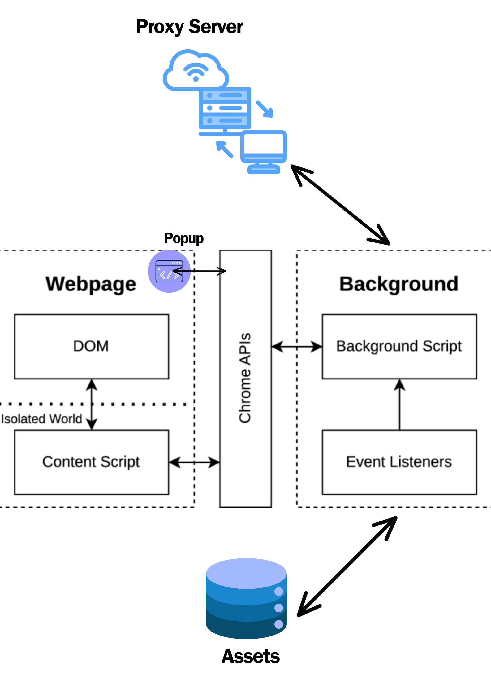
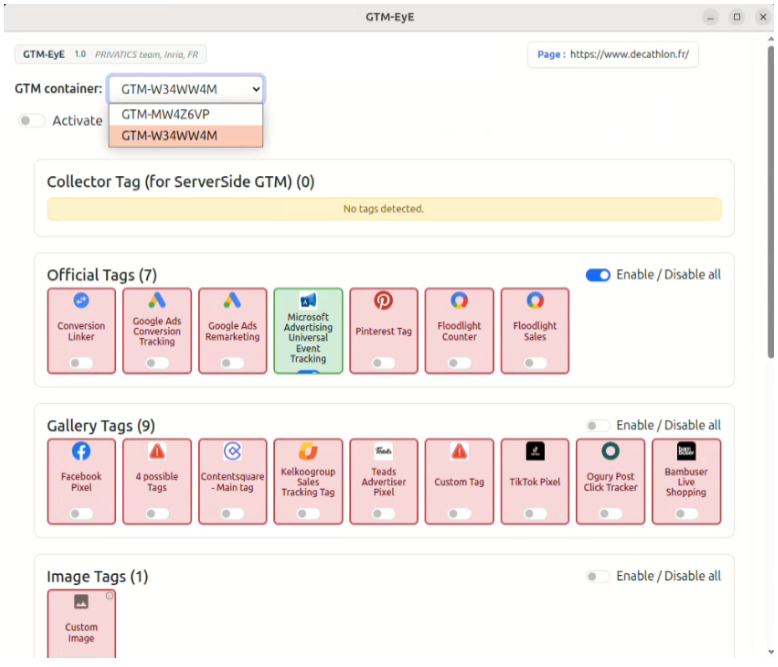
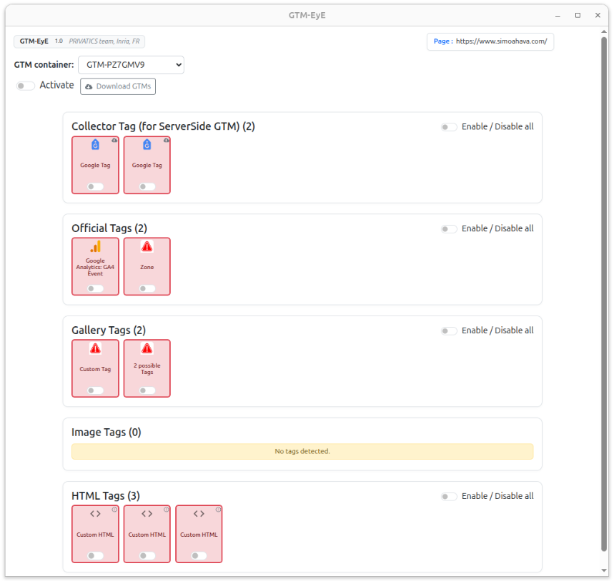
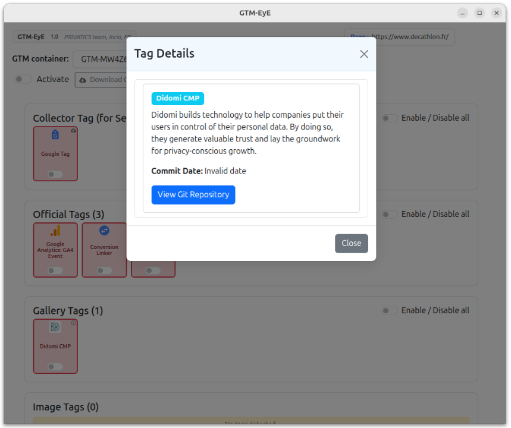
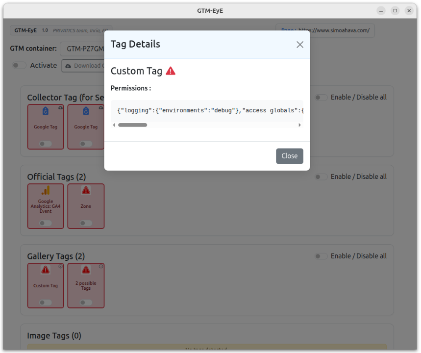
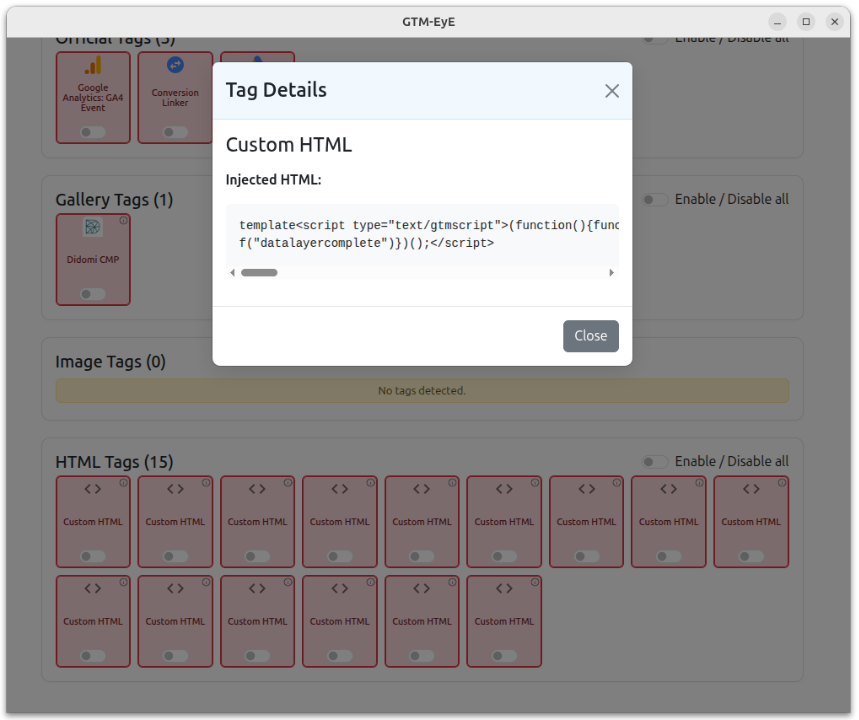
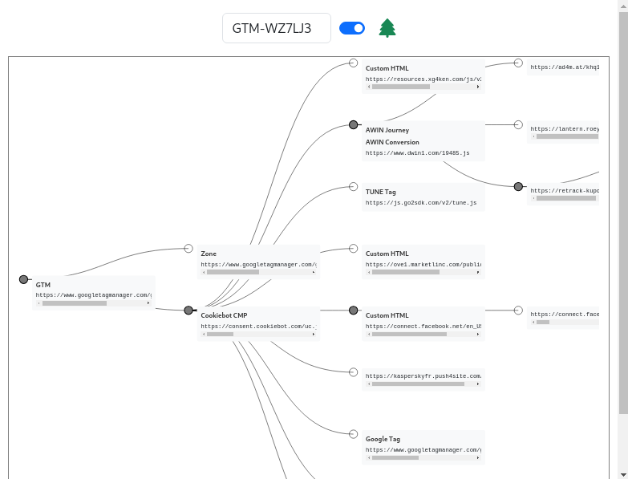

<!--
::: titlepage
::: sffamily
 

::: center
[PRIVATICS TEAM - INRIA]{.smallcaps}\
-->


GTM-EyE Technical Documentation
===============================


Marouane **AKASSAB**<sup>(2)</sup>, Gilles **MERTENS**<sup>(1)</sup>, Vincent **ROCA**<sup>(1)</sup>, Youssef **El Atia**<sup>(2)</sup>

<sup>(1)</sup> Centre Inria of Univ. Grenoble Alpes, PRIVATICS team, France     
<sup>(2)</sup> Univ. Grenoble Alpes, ENSIMAG

Official Github page: [https://github.com/gtm-eye](https://github.com/gtm-eye)

-----------

# 1- Overview


This project is a comprehensive Chrome extension designed to enhance the
management and monitoring of **Google Tag Manager (GTM)** scripts. The
extension offers robust functionalities to detect, block, and analyze
tags inside GTM containers, providing users with enhanced control over
the scripts that are executed in their browsers.

# 2- Functionalities

## Real-Time Detection

The extension detects Google Tag Manager (GTM) scripts as they are being
loaded in real-time, allowing for immediate responses based on the
detected scripts.

## Real-Time Blocking

Once a GTM script is detected, it can be blocked instantly to prevent
execution, or blocked after a refresh depending on the level of
obfuscation.

## Multiple GTMs

The extension supports handling and processing multiple GTM scripts
simultaneously. This allows for efficient management of several GTM
instances without degrading performance. See
Figure [2](#fig:multipleGtms){reference-type="ref"
reference="fig:multipleGtms"} .

## Tags Identification

The extension recognises five distinct categories of tags inside a GTM con-
tainer:
- Official tags – built-in templates provided by Google (e.g. GA4, Google Ads).
- Gallery tags – community templates published in the GTM Template Gallery.
- Custom tags – publisher-defined tags or modified gallery templates.
- Image / Pixel tags (img) – single-pixel or tracking-beacon tags; they are excluded from tag-fusion to avoid breaking analytics counters.
- Server-side tags – tags whose serverContainerType is ``SERVER''; detected even when the client container only hosts the trigger.

See Figures
[3](#fig:tagsIdentification){reference-type="ref"
reference="fig:tagsIdentification"},
[4](#fig:galleryTag){reference-type="ref" reference="fig:galleryTag"},
[5](#fig:customTag){reference-type="ref" reference="fig:customTag"} and
[6](#fig:htmlTag){reference-type="ref" reference="fig:htmlTag"} .

## Allowing custom GTM execution

This functionality provides flexibility in managing the execution of GTM
scripts according to user preferences. See Figure
[7](#fig:customExecution){reference-type="ref"
reference="fig:customExecution"} .

## Downloading GTM Containers

The extension allows users to download all detected GTM containers as a JSON file by clicking the ``Download GTMs'' button.
The file is named site YYYYMMDD-HHMMSS.json and contains:
- The page domain and export timestamp,
- A list of detected GTM containers (ID, URL, blocked status, obfuscation level),
- For each container, the list of tags with their name, type (official/gallery/custom), and active status.

This feature helps with offline analysis and comparisons between pages.

## Site Execution CSV

The file ```public/assets/sitesConfig.csv''' lets you re-enable specific tags, or an entire GTM container, per domain.      
```
domain,token 1 | token 2 |...
```

- domain: exact hostname.
- token: all (run full container) or tag IDs / aliases separated by “|”.

Example: ```example.com,all · news.site.org,__img'''

The worker loads the CSV at startup; matching tokens are applied when rebuilding the container before injection.

<!--
## Injection Tree

The InjectionTree feature provides a visual representation of scripts
injected by a GTM container within a web page. It displays a
hierarchical view of the structure and flow of GTM scripts, helping
users understand the injection hierarchy and interactions. See Figure
[8](#fig:injectionTree){reference-type="ref"
reference="fig:injectionTree"} .
-->

# 3- Architecture

## Hierarchy

-   **public/** : Contains files used in the Chrome extension.

    -   **assets/** : Contains Maps used in the extension.

        -   **officialTags.js** : List of all official tags.

        -   **officialTagsMap.json** : Official tags map.

        -   **galleryMap.json** : Gallery tags map.

        -   **galleryPermsMap.json** - Gallery tags permissions map,
            which isn't used in the extension but aids in debugging.

    -   **gtm-lib/** : Library files for GTM data handling.

        -   **gtmDataExtractor.js** : Extracts data from GTM scripts.

        -   **gtmDataParser.js** : Parses GTM data.

        -   **gtmInjectionTree.js** : Manages the GTM injection tree.

    -   **images/** : Image assets for the extension.

    -   **manifest.json** - Configuration file for the Chrome extension.

    -   **detection_rules.json** - Rules for detecting and blocking gtm
        scripts.

    -   **background.js** : Background script for the Chrome extension.

    -   **contentScript.js** : Content script for the Chrome extension.

    -   **index.html** - The chrome extension popup.

-   **src/** - React source code of the front end of the extension.

-   **scripts/** - Custom scripts used in the project.

    -   **init.sh** : Script that generates the tags maps.

    -   **init.js** : Script containing code of maps generation.

-   **proxy-server/** : Server that sends requests needing custom
    headers.

    -   **server.js** : Script that runs the server.

    -   **domainObfuscation.js** : Gtm script with obfuscated domain.

    -   **encoded.js** : Base64 encoded gtm script.

    -   **evalObfuscation.js** : Script injecting the `encoded.js` using
        `eval`.

    -   **doubleObfuscation.js** : Script that dynamically injects the
        `evalObfuscation.js` script.

-   **obfuscation-server/** : Web app loading obfuscated GTM scripts.

    -   **run.sh** : Script that runs the server.

    -   **index.html** : HTML page for a web app loading obfuscated GTM
        scripts.

## Overview

{width="50%"}

# 4- Detailed Specification

## Obfuscation levels

Obfuscation levels refer to the different ways of injecting a GTM script
into a web page. Some publishers inject GTM scripts using the default
way [@criteo], in which they copy and paste a javascript code given by
the Google Tag Manager platform in the head of the page. This code
dynamically injects a script tag in which the source is the GTM script
URL :

``` {.html language="HTML" breaklines="true" basicstyle="\\ttfamily"}
<script async src="https://www.googletagmanager.com/gtm.js?id=GTM-M4Z343H"></script>
```

As a result a request to
`https://www.googletagmanager.com/gtm.js?id=GTM-M4Z343H` is made.
However, this isn't the only way of injecting GTM scripts, as some
publishers choose to load their GTM scripts from custom domains [@bmj]
and/or different script names [@wise]. For further obfuscation some
publishers automatically remove the script tag from the DOM after
injecting the GTM script [@wise]. Thus, we classified the injection of
GTM scripts into three categories.

### Obfuscation Level 1

The first level of obfuscation is when publishers inject the GTM script
from a URL containing the GTM identifier of the container which matches
the pattern `GTM-[A-Z0-9]{4,}`. Neither the domain or the script name
matters, as long as that URL contains a valid GTM identifier. For
example the three cases discussed above fall into this category.

### Obfuscation Level 2

The second level of obfuscation is when publishers inject the GTM script
from a URL that doesn't contain the GTM identifier of the container.
Never seen this case in the real world, however a POC is available at
`obfuscation-server/` using the `proxy-server/domainObfuscation.js`
script.

### Obfuscation Level 3

The third level of obfuscation is when the GTM script is never requested
as a **script** but rather in an encoded format and then executed in
arbitrary way using `eval` for example. Never seen this case in the real
world, however a POC is available at `obfuscation-server/` using the
`proxy-server/evalObfuscation.js` or `proxy-server/doubleObfuscation.js`
scripts.

## Detection

In the first two levels of obfuscation we detect the GTM script before
its execution because the detection is based on a **Static Analysis** of
the URLs or Scripts content. However, in the third level the detection
is based on a **Dynamic Analysis**, thus the detection occurs after the
script execution.

### Obfuscation Level 1

For this level of obfuscation we have a static rule that automaticaly
detects and blocks requests based on two conditions:

-   **resourceType** : Script

-   **urlFilter** : \"\*://\*/\*?id=GTM-\*\"

However there are some requests that include the GTM identifier and are
not GTM scripts. Luckily these requests only send data using GET/POST
requests but aren't actually requesting a Script. So, they won't trigger
the rule mentionned above.\
**Note**: In this level of obfuscation we don't have to request the
script using the URL of injection that could be blocked by Cors [@bmj]
or a referer validation [@wise], because we can fetch the script Content
using the GTM URL

``` {.html language="HTML" breaklines="true" basicstyle="\\ttfamily"}
https://www.googletagmanager.com/gtm.js?id=EXTRACTED_GTM_ID
```

with the extracted GTM identifier.

### Obfuscation Level 2

In this level of obfuscation we can't detect a GTM Script simply from
the URL, so we necessarily need to check its content to verify if it is
a GTM script or not. As a result, we set up a static rule that listens
for all requested scripts. Unfortunatly, at the moment of writing this
doc we can't block requests based on the response's body. In fact we
can't even get response's body while listening to requests [@response].
Thus for each script requested we must fetch its content to see if it is
a GTM script. However fetching can fail because of **CORS Blocking** :
Some publishers block fetching their GTM scripts, even from their own
website [@bmj], this can be bypassed by fetching the script content from
the **background.js** instead of the **contentScript.js**. However, we
lose the `Referer` header, which can't be overridden in the
**background.js**. So if there is extra **Referer Validation**, the
fetch would fail [@wise]. To solve this problem we added a **Proxy
Server** to set the `Referer` as required or override any other header.

### Obfuscation Level 3

All the detection methods discussed above will fail at this level of
obfuscation, because the GTM script is never loaded as a script and
could be in unrecognizable format. So instead of a static detection
based on the URL, or the content of the script, here we take a dynamic
approach in which we detect the GTM script after its execution based on
its default behaviour. In fact, after its execution the GTM script
defines a global variable called **google_tag_manager** which contains
information about the state of all the GTM scripts that were executed on
the page identified by theair GTM IDs. As a result, we can extract the
GTM IDS and use them to fetch the scripts content using the GTM URL

``` {.html language="HTML" breaklines="true" basicstyle="\\ttfamily"}
https://www.googletagmanager.com/gtm.js?id=EXTRACTED_GTM_ID
```

However, at this point we don't actually know the real URL, or the
script that injected the GTM script.

## Blocking

### Obfuscation Level 1

In the first level of obfuscation the blocking and the detection are
actually the same, we have one static rule that detects and blocks the
URLs injecting GTM scripts.

### Obfuscation Level 2

After detecting the GTM script, we immedialtely add a dynamic rule
blocking the URL of injection and we automatically refresh the page for
the rule to take effect.

### Obfuscation Level 3

After detecting the GTM container executed on the page we need to find a
way to get to the script or the URL that caused its execution. This is
achieved through looking for a tag in the container that can inject
scripts, and look recursively in the call stack that initiated the
injection of those scripts untill we find the name of the script that
was responsible of the the injection. That is the script that loaded the
GTM script and executed in a arbitrary way. Here, if we simply block the
script from loading we wouldn't be able to get the content of the GTM
script because we don't know the method of obfuscation used. To solve
this problem instead of blocking it we add a dynamic **redirection**
rule that redirects the request of injection to requesting the GTM URL

``` {.html language="HTML" breaklines="true" basicstyle="\\ttfamily"}
https://www.googletagmanager.com/gtm.js?id=EXTRACTED_GTM_ID
```

As a result, instead of interacting with the obfuscated script we
interact with its equivalent unobfuscated GTM script.

## Tags Identification

Tags Identification is achieved through static analysis of the GTM
script. The script has a javascript object called **data**, which
contains all the informations about the tags configuration: the list of
tags, tags permissions, tags runtime code in obfuscated format. Each
element of the tags list is a javascript object which always contains a
key called **\"function\"** and its value contains underscores and
alphanumeric characters, and the other key/value paires contain the
configuration params.

### Official Tags

The **\"function\"** value seems obfuscated at first glance. However
after examining how the GTM platform stores official tags through
inspecting the JSON response of the

``` {.html language="HTML" breaklines="true" basicstyle="\\ttfamily"}
https://tagmanager.google.com/api/accounts/6232611677/containers/186048373/templates?hl=en
```

request which is the request that fetches the list of official tags in
the GTM platform, we understood that each official tag is mapped to a
function that matches this Regex **\_\_\[a-z0-9\]\*** for example the
`LinkedIn Insight` official tag is mapped to the `__bzi` function. As a
result we simply generated a map that maps each function to its
corresponding official tag.\
\
**Note**: An interesting finding here is the **Zone** tag which isn't
available at the GTM platform, but is present in the JSON response
because it is a payed feature. This tag allows publishers to inject
child GTM containers, and is quite used by publishers [@mailchimp]
[@kaspersky].

### Gallery Tags

Identifying gallery tags is a little bit challenging, because the
**\"function\"** value is in this format
**\_\_cvt\_\[0-9\]\*\_\[0-9\]\*** in which the first numeric value is
the same for all gallery tags in the same GTM container, however the
second numeric value isn't always the same and we also didn't have a
clue on their meaning. After testing with some gallery tags with our GTM
container we noticed that the first numeric value is actually the
**ContainerId** which is a numeric value that identifies the GTM
container in the GTM platform and differs from the GTM identifier that
starts with GTM- , and the second numeric value is actually the
**VersionId** which is a numeric value that identifes the first version
of publication of a gallery tag inside this container without any
indication to the identity of the tag. The other key/value paires can be
generic and not enough to identify a gallery tag. As a result a gallery
tag's data in the tags list isn't enough to identify it.\
\
To solve this problem we have two solutions : identifying a gallery tag
through its runtime code or identifying a gallery tag through its
permissions. The first solution is quite challenging because the code is
heavily obfuscated. However, the tag's permissions are stored in a
javascript object without any obfuscation. Nevertheless, the mapping
isn't obvious at first glance because after examining how the GTM
platform stores gallery tags using this API [@gallery] we noticed that
the tags permissions in the JSON response are in a generic format that
differs from the tags permissions format that is displayed on the GTM
script. However it is possible to go from one format to the other. Thus,
we made an algorithm that parses the generic format and generates the
same output displayed on the GTM script so we can map permissions to
tags. As a result, each gallery tag has a signature which is the
**sha256** hash of its permissions generated by the algorithm.\
\
However, unlike official tags which are automatically updated by the GTM
platform, publishers can use old versions of gallery tags [@mailchimp],
and unfortunately the API [@gallery] only returns the latest version of
gallery tags so we only have the signatures of the latests versions
gallery tags, however the JSON response mentions for each gallery tag
the list of its old versions by their github commits ID. So, using the
github api we extracted their permissions from their github repository
so we can add their signatures to the Gallery Map.\
\
**Note:** Permissions contain names of params, ids, domains of script
injection that are directly linked to the tag so it is generally hard to
have collisions. However, There are some minor collisions of signatures.
At the time of writing this doc we have **43** collisions which is
**3.3%** of the total number of signatures: **1303**.

### Custom Tags

Custom tags are gallery tags that were modified by the publisher, or
tags that were created by the publisher. In this case we simply extract
their permissions to have a general idea of their behaviour. We never
came across a modified gallery tag in the real world, however publishers
creating their own tags is a common practice [@wise].

### Image / Pixel Tags

Some templates generate a single-pixel tracking request instead of a script (`` or XHR beacon). In the GTM payload they are usually mapped
to the helper function img. Detection is therefore straightforward:
- Static rule: function == " img"or the presence of the field "isImagePixel": true.
- Special treatment: Pixel tags are excluded from tag-fusion and remain visible
in the UI, even when similar tags are merged, to avoid breaking tracking counters.
They appear under the Image category (blue picture-icon) in the sidebar.

### Collector / Server-Side Tags

A collector tag is configured to route events to a server-side GTM container. Inside
the tag object we typically find:
- the key "serverContainerType": "SERVER", or
- a parameter such as transport url pointing to the collector endpoint, e.g.
```https://gtm-server.example.com.```

Once detected, the tag is labelled Server-Side (orange) in the UI. Because
execution occurs in the remote container, the extension does not attempt runtime
code extraction; instead it surfaces the transport urlso that analysts can inspect
the downstream endpoint.

## Allowing Custom GTM Execution

After Blocking a GTM script the user can choose to allow it to be
executed. However, instead of just removing the blocking we actually
inject a new script into the page in order to have control over its
content. This way we can inject a modified script according to the user
preferences.

### Custom Tags Execution

Using a dynamic analysis of the GTM script we noticed that it iterates
through the tags list in the data variable in order to execute each tag.
So by modifying the tags list, in this case removing tags that were
chosen to be blocked leads to executing the GTM script without executing
the tags removed. However, we consider this as an experimental feature
because we noticed that some tags can be dependant so blocking one can
lead to blocking other tags.

<!--
## Injection Tree

### Tree Generation

To generate a recursive tree of injection we should know the initiator
of each injected script. Unfortunately, simple network listeners don't
have the initiator param. So we were forced to attach a debugger to the
page (programatically), to have access to the intiators and the the call
stack of each injected script. To represent the tree, we created a
**TreeNode** class which has three attributes :

-   **url** : The URL of the injected script.

-   **tags** : The tags that could inject this script.

-   **children** : The List of children nodes, which contains the
    scripts that were injected by this script.

To optimize the Tree generation, we created a **nodeMap** that maps each
URL to the reference of its TreeNode, so when adding a child node we
immediately have the intitor's TreeNode without searching through the
tree.

### Tags mapping

Tags mapping can't be done through a dynamic analysis because we didn't
find a way to know which tag is executed when a script is injected.
Thus, we followed a static approach in this case in which we parse all
the tags in the GTM container to extract all the scripts that could be
injected by each tag. For official tags, all the tags that have the
permissions to inject scripts indicates possible URL patterns of
injection. For gallery tags there are some that have the injectScript
permissions but don't indicate the URLs of this injection, in this case
the URLs of injection are extracted from their runtime code in the GTM
script. For custom tags the URLs of injection are also extracted from
their runtime code.\
We use the extracted URLs of injection to create the **scriptsMap** that
maps each URL pattern to its possible injectors and not an injector
because publishers sometimes use the same tag in multiple ways for
example as a Gallery Tag and as a HTML Tag [@mailchimp].\
**Note:** Some tags might be using wildcards **\*** in their URLs of
injection, so instead of directly accessing the possible injectors using
the scriptsMap, we actually iterate through all the keys and transform
each key into a Regex to see if there is a match.
-->

## About The Manifest V3

Generally, MV3 offers a streamlined setup and improved usability for
developers, making it easier to create and manage Chrome extensions.
However, Its new features and APIs may introduce some new challenges
that developers need to navigate. Here i will point out few of the
challenges that i faced .

### No Access to Response Body of Requests

In MV3, direct access to the response body of network requests is
restricted to the `responseHeaders` [@response]. This change aims to
enhance privacy and performance but poses limitations for scenarios
where inspecting the response body is necessary. To work around this
limitation, we fetch the request separately to access and analyze its
response body.\
\
**Note:** An alternative workaround to refetching the request is to use
the **chrome.devtools.network.onRequestFinished** API [@devtoolsApi].
However, this approach requires manually opening the DevTools and cannot
be automated programmatically [@devtools].

### No Arbitrary Code Execution

MV3 imposes restrictions on arbitrary code execution, primarily for
security reasons. This affects our ability to dynamically execute custom
GTM script strings. A workaround for this is to create the code in the
unsafe page context: the **MAIN** world, and not in the default
**ISOLATED** world [@arbitraryJs] .

## Notes

### Proxy Server

The Proxy Server is used to bypass referer validation by publishers
[@wise]. It is also serving the obfuscated GTM scripts using CORS
Blocking or/and Referer Validation. See the **server.js** for more
details.\
**Note:** Serving the GTM scripts has no relation with its main
functionnality which is overriding custom headers. Thus, serving GTM
scripts can be done seperately.

### Obfuscation Server

The Obfuscation Server is a webApp used to test the second and third
levels of obfuscation. The **index.html** file contains the code that
injects GTM scripts for different case scenarios. All you have to do is
uncomment the case scenario to test and comment the others. To run the
app, simply execute the **run.sh** script, the page will be found at
`http://localhost:8000/`\
**Note:** The Proxy Server should be running while testing the
Obfuscation Server because GTM scripts are served by the Proxy Server.

### Maps Generation

After installing the extension you will find the maps already generated.
For official tags the map generation uses the JSON response of the
request in the GTM platform which was manually copied to
**officialTags.js**. However, gallery tags are automatically fetched
[@gallery].\
\
To update the maps simply execute the **scripts/init.sh** script. The
**officialTagsMap.json** is instantly generated, however, the
**galleryMap.json** can take up to **30 min** because the Github API
doesn't support asynchronous fetching. Thus, we used a synchronous loop
which explains the long duration.\
**Note:** The execution of the **scripts/init.sh** script will delete
all the previous maps before generating the new ones.

### Github Token

To extract all the versions of a gallery tag we use the github API.
However, there are rate limit for unauthenticated users [@github] .
Thus, we use an access token linked to my github account to have a
bigger rate limt [@github]. This token is hard coded in two places :

-   **script/init.js** : Gihub Token used to fetch all versions of
    gallery tags.

-   **src/components/GalleryTagModal.jsx** : Gihub Token used to fetch
    the commit Date of a gallery Tag.

The Github Token will expire on **Oct 21 2024**, so make sure to update
it with a new one afterwards.\
**Note:** The Github Token has only access to **Public Information**, so
there aren't any security issues.

{#fig:multipleGtms width="80%"}

{#fig:tagsIdentification width="80%"}

{#fig:galleryTag width="80%"}

{#fig:customTag width="80%"}

{#fig:htmlTag width="80%"}

{#fig:customExecution width="80%"}

<!-- {#fig:injectionTree width="80%"} -->


# References

- Criteo, <https://www.criteo.com/>,
<https://www.googletagmanager.com/gtm.js?id=GTM-M4Z343H>

- BMJ, <https://www.bmj.com/>,
<https://analytics.bmj.com/gtm.js?id=GTM-NF7HCLL>

- Wise, <https://wise.com/>, <https://gtm.wise.com/wisetag?id=GTM-M7V2XH>

- Kaspersky, <https://www.kaspersky.fr/>,
<https://sgtm.kaspersky.de/gtm.js?id=GTM-WZ7LJ3>

- Mailchimp, <https://mailchimp.com/fr/>,
<https://www.googletagmanager.com/gtm.js?id=GTM-MCZTKL>

- [\"https://tagmanager.google.com/api/gallery/templates\"]("https://tagmanager.google.com/api/gallery/templates"){.uri}

- <https://developer.chrome.com/docs/extensions/reference/api/webRequest#event-onCompleted>

- <https://developer.chrome.com/docs/extensions/reference/api/devtools/network#event-onRequestFinished>

- <https://issues.chromium.org/issues/40146737>

- <https://stackoverflow.com/questions/70949491/how-to-inject-a-script-from-text-string-provided-by-the-user-or-external-api/70949953#70949953>

- [\"https://docs.github.com/en/rest/using-the-rest-api/rate-limits-for-the-rest-api?apiVersion=2022-11-28\"]("https://docs.github.com/en/rest/using-the-rest-api/rate-limits-for-the-rest-api?apiVersion=2022-11-28"){.uri}

